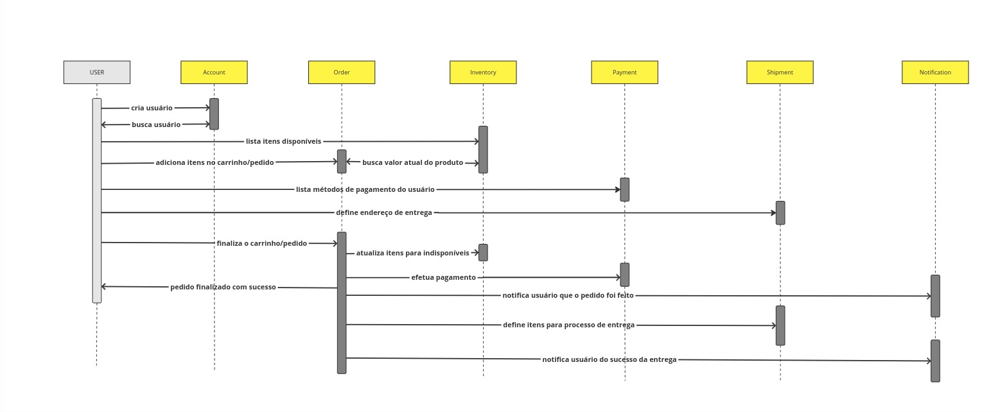

[](https://github.com/Filipe-m/IF-Store/actions/workflows/tests.yml)

# IF-Store

> IF-Store is a simple e-commerce application that allows users to browse products, add them to a cart, and checkout. The application is built using `Golang` and `Nodejs`.

## Organization
<p align="center">
  
</p>

### The project is divided into seven parts:
- Account Service - Responsible for managing user account information.
- Order Service - Responsible for managing orders and order history for the user.
- Inventory Service - Responsible for managing products and inventory for the store and users.
- Payment Service - Responsible for managing payments and transactions between the user and the store.
- Shipment Service - Responsible for managing shipments and delivery of products.
- Notification Service - Responsible for managing notifications to the user about their orders.
- Frontend - The user interface for the application.

## Sequence Diagram
<p align="center">
  
</p>


## Setup

The project is built using `Docker` and `Docker Compose`. To run the project, you need to have `Docker` and `Docker Compose` installed on your machine.

### Running the project
1. Clone the repository
2. Run with docker-compose
```bash
cd docker/deployment && docker-compose up
```
3. Access the application at `http://localhost:3000`
4. Enjoy!

### Running the tests
> The tests can be found in the `test` directory. To run the tests, you need to have Go installed on your machine. To run the stress tests, you need to have k6 installed on your machine.

1. Run the unit test 
```bash
cd src/{service} && go mod download && go test -v ./...
```

2. Run the contract test
```bash
  cd test/contract/docker && docker-compose up
```
```bash
  cd test/contract && go mod download && go test -v ./...
```

3. Run the integration test
```bash
  cd test/integration/docker && docker-compose up
```
```bash
  cd test/integration && go mod download && go test -v ./...
```

4. Run the component test
```bash
  cd test/component/docker && docker-compose up
```
```bash
  cd test/component && go mod download && go test -v ./...
```

5. Run the end2end test
```bash
  cd test/end2end/docker && docker-compose up
```
```bash
  cd test/end2end && go mod download && go test -v ./...
```

6. Run the stress test
```bash
  cd test/stress && k6 run script.js
```
```bash
  cd test/end2end && k6 run finish_order.js 
```

## License
This project is licensed under the MIT License - see the [LICENSE](LICENSE) file for details.
